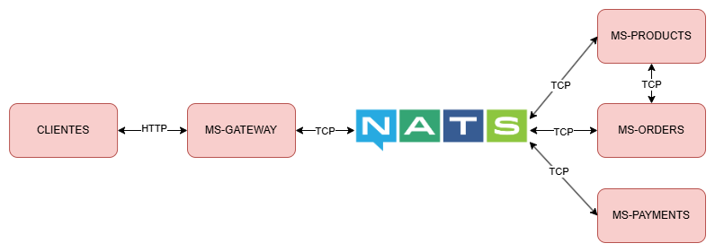

<p align="center">
  <a href="http://nestjs.com/" target="blank"></a>
</p>

# MS-ORDERS

## Levantar el proyecto

1. Clonar el repositorio
2. Instalar los modulos de node
3. Crear un archivo `.env` basado en el `env.template`
4. Ejecutar el comando `docker compose up -d` para levantar la base de datos
5. Ejecutar migración de prisma `npx prisma migrate dev`
6. Levantar el servidor de NATS
```
docker run -d --name nats-server -p 4222:4222 -p 8222:8222 nats
```
7. Ejecutar `npm run start:dev`

## Arquitectura del Proyecto

<p align="center">
  
</p>

- [MS-ORDERS](https://github.com/Gibson-Arbey/NEST-MS-ORDERS)
- [MS-PAYMENTS](https://github.com/Gibson-Arbey/NEST-MS-PAYMENTS)
- [MS-GATEWAY](https://github.com/Gibson-Arbey/NEST-MS-GATEWAY)
- [MS-PRODUCTS](https://github.com/Gibson-Arbey/NEST-MS-PRODUCTS)